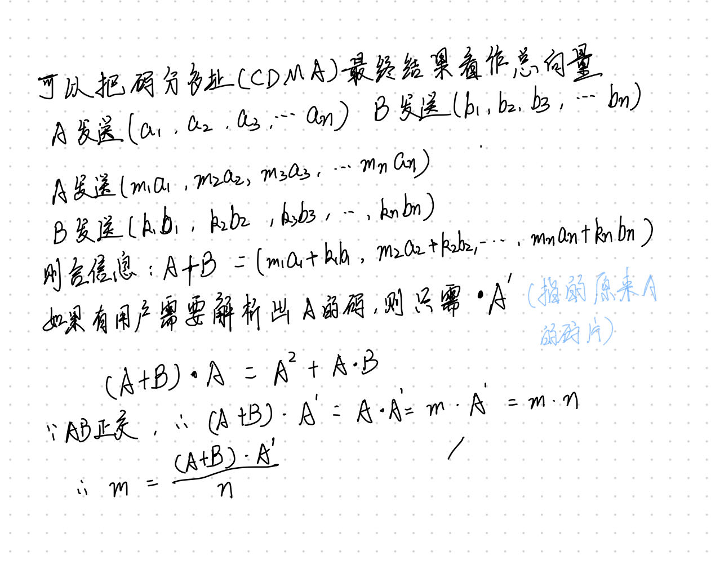

# 第一章 引言

## 1.2	网络硬件

## 1.3	网络软件

## 1.4	参考模型

### 1.4.1	OSI七层参考模型

#### 1.物理层

- 传输数据单位是比特（Bits）
- 利用传输介质为数据链路层提供物理连接，负责处理数据传输并监控数据出错率，以便数据流的透明传输。

#### 2.数据链路层

- 数据传输单位是帧（Frame），是对包的封装。
- 在物理层提供的服务基础上，在通信的实体间建立数据链路连接（通过MAC地址进行物理寻址），传输的数据单位是“帧”，并采用差错控制与流量控制方法，使有差错的物理线路变成无差错的数据链路。
- 典型的设备是交换机SWITCH

#### 3.网络层

- 包是数据在网络层的名称。路由器根据包里的IP地址进行路由转发。
- 为数据在节点之间传输创建逻辑链路，通过路由选择算法为分组通过通信子网选择最适当的路径，以及实现拥塞控制、网络互连等功能。
- 地址管理和路由选择是这一层的核心
- 因为MAC物理地址无法快速定位，所以IP地址这种逻辑地址来进行寻址和路由选择，IP是实现端到端的基础。
- 典型设备是路由器

#### 4.传输层

- 段是数据在传输层里的名字。
- 向用户提供可靠地端到端服务，处理数据包错误、数据包次序，以及其他一些关键传输问题。传输层向高层屏蔽了下层数据通信的细节。因此，它是计算机通信体系结构中关键的一层。
- IP逻辑地址和MAC物理地址可以做到找到主机，但是主机可能运行着无数多个软件进程，需要用到端口号来定位。在端到端的传输基础上实现了进程到进程的传输。
- 主要是由TCP（可靠）和UDP（不可靠）这两个协议

#### 5.会话层

- 负责维扩两个结点之间的传输连接，以便确保点到点传输不中断，以及管理数据交换等功能。会话进行身份验证、会话管理和确定通讯方式。一旦建立连接，会话层的任务就是管理会话。

#### 6.表示层

- 用于处理在两个通信系统中交换信息的表示方法，主要包括数据格式变换、数据加密与解密、数据压缩与恢复等功能。表示层主要是解释通讯数据的意义，如代码转换、格式变换等，使不同的终端可以表示。还包括加密与解密、压缩与解压等。

#### 7.应用层

这一段可以看下面这个视频帮助理解：

> https://www.bilibili.com/video/BV1EU4y1v7ju/?spm_id_from=333.337.search-card.all.click&vd_source=7cfc5b28b2a85059a2348b997c16ea4f

# 第二章 物理层

## 2.1	数据通信的理论基础

### 1.傅里叶分析

任何一个行为合理周期为T的函数g(T)，都可以表示成用正弦函数和余弦函数组成的正无穷级数

### 2.一些术语

- 带宽：一段在传输过程中振幅不会明显减弱的频率宽度就称为带宽。

- 基带信号：从0到某个最大频率的信号称为基带信号

- 通带信号：被搬移并占用某个更大频率范围的信号称为通带信号。

- 码元：在使用时间域（或简称为时域）的波形表示数字信号时，代表不同离散值的基本波形称为码元。其实就是**信号变化一次就是一个码元**

- 波特率：1秒钟能够发送的码元的个数，所以也叫码率。每秒钟信号变化的次数

- 比特率：1秒钟能够发送的比特的个数。如果一个码元只传输一位比特，那么比特率=波特率。
  $$
  C=B×log_2n
  $$
  这是比特率和波特率转换公式，其中C：比特率；B：波特率；n：调制电平数或线路的状态数，为2的整数倍

### 3.信道的最大数据速率

​	1.**奈氏准则**：在任何信道中，码元传输的速率是有上限的，否则就会出现码间串扰的问题，使接收端对码元的判决（即识别）成为不可能。也就是说，传输速率的提高与信号的带宽成正比例关系，否则就会产生大量失真。理想情况下（无噪声），最高码元传输速率是：
$$
B=2W(波特)
$$
W是理想信道的带宽，单位是赫兹（Hz）

所以最大传输速率(bits/s)：
$$
C=2Wlog_2n
$$
​	2.**香农公式**：对于一条带宽是W、信噪比$\frac{S}{N}$的有噪声信道，最大数据传输速率C是：
$$
C=B×log_2(1+\frac{S}{N})
$$
​	3.**信噪比**：一般用分贝来表示，计算公式是：
$$
10log_{10}\frac{S}{N}(dB)
$$
​	4.**两个公式之间的关系如何理解？** 首先，两个公式使用的范围不同，在奈氏准则求最大传输速率是在理想信道中，而香农公式求信噪比是在有噪声信道中。同时，两者表示的最大数据速率分别是从不同角度来说的。奈氏是从码元的角度，当带宽确定，码元的最大传输速率也就确定了，要提升比特率，只能使一个码元携带更多的比特才能提高。而香农公式是从信噪比，当信噪比越大，比特率越大。当一道题目既可以用香农也可以用奈氏的时候，应当使用二者当中较小的那个作为最后的答案。

> 如果在一条3k Hz的信道上发送一个二进制信号，该信道的信噪比是20dB，试问可达到的最大数据速率是多少？

首先可以算出信噪比$S/N = 100$，由香农公式，则$C=3000log_2101\ b/s$，而通过奈氏准则$C=6000\ b/s$，所以选奈氏准则的那个结果。

## 2.2	引导性传输介质

## 2.3	无线传输

## 2.5	数字调制与多路复用

### 2.5.1	基带传输

1. 不归零编码（NRZ）：正电压表示1，负电压表示0
2. 

### 2.5.2	通带传输

### 2.5.3	频分复用(FDM)

### 2.5.4	时分复用(TDM)

### 2.5.5	码分多址(CDMA)

对上述三种复用方式，用我自己觉得可以理解的方式来说就是，FDM是只能听到特定频率的消息，类似于收音机。TDM是只能听到特定时间的声音，类似与看节目。而CDM则是只能听到特定人的声音，就像在一个嘈杂的有着各种方言的车厢里，只能听明白老乡的话（方言）。

对于码分多址，我用一个只有两个发送方的例子来证明一下可行性：

所以，要知道特定站发送的内容，只需乘那个站的码片再除以n，就能求得了。如果是+1，那么就是1，-1就是0，0就是没有发送。

## PCM

# 第三章	数据链路层

## 3.2	差错检测和纠正

### 3.2.1	纠错码

#### 1.海明码

海明距离：两个码字中不相同的位的个数。**要可靠地检测n个错误，需要一个海明距离为n+1的编码方案**，因为如果海明距离等于错误数n的话，会导致一个编码变成另一个编码而导致无法分辨究竟是错了还是原来就是这般。**而要纠错n个错误，则需要一个海明距离为2n+1的编码方案。**因为错误数一旦大于$\frac{d-1}{2}$（d是海明距离），就会无法纠错。

> 现有0000000000、0000011111、1111111111、1111100000这四个码，其海明距离为5。也就是说它只能可靠地检测4个错误，只能可靠地纠错2个错误。因为如果出现5个错误，就会从0000000000变成0000011111，两个都没错，所以无法检测出来。如果出现3个错误，例如从0000000000变成了0000010110，此时纠错的话就会纠错成0000011111

海明码的海明距离是3，只能纠错一个检测两个。
