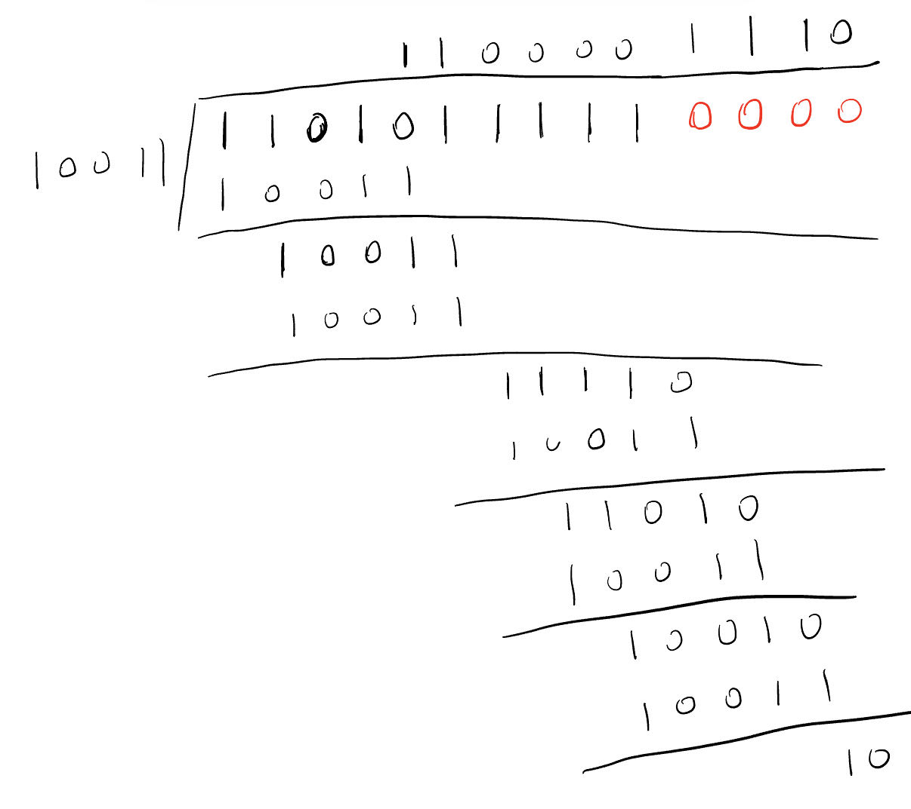

# 第一章 引言

## 1.2	网络硬件

## 1.3	网络软件

## 1.4	参考模型

### 1.4.1	OSI七层参考模型

#### 1.物理层

- 传输数据单位是比特（Bits）
- 利用传输介质为数据链路层提供物理连接，负责处理数据传输并监控数据出错率，以便数据流的透明传输。

#### 2.数据链路层

- 数据传输单位是帧（Frame），是对包的封装。
- 在物理层提供的服务基础上，在通信的实体间建立数据链路连接（通过MAC地址进行物理寻址），传输的数据单位是“帧”，并采用差错控制与流量控制方法，使有差错的物理线路变成无差错的数据链路。
- 典型的设备是交换机SWITCH

#### 3.网络层

- 包是数据在网络层的名称。路由器根据包里的IP地址进行路由转发。
- 为数据在节点之间传输创建逻辑链路，通过路由选择算法为分组通过通信子网选择最适当的路径，以及实现拥塞控制、网络互连等功能。
- 地址管理和路由选择是这一层的核心
- 因为MAC物理地址无法快速定位，所以IP地址这种逻辑地址来进行寻址和路由选择，IP是实现端到端的基础。
- 典型设备是路由器

#### 4.传输层

- 段是数据在传输层里的名字。
- 向用户提供可靠地端到端服务，处理数据包错误、数据包次序，以及其他一些关键传输问题。传输层向高层屏蔽了下层数据通信的细节。因此，它是计算机通信体系结构中关键的一层。
- IP逻辑地址和MAC物理地址可以做到找到主机，但是主机可能运行着无数多个软件进程，需要用到端口号来定位。在端到端的传输基础上实现了进程到进程的传输。
- 主要是由TCP（可靠）和UDP（不可靠）这两个协议

#### 5.会话层

- 负责维扩两个结点之间的传输连接，以便确保点到点传输不中断，以及管理数据交换等功能。会话进行身份验证、会话管理和确定通讯方式。一旦建立连接，会话层的任务就是管理会话。

#### 6.表示层

- 用于处理在两个通信系统中交换信息的表示方法，主要包括数据格式变换、数据加密与解密、数据压缩与恢复等功能。表示层主要是解释通讯数据的意义，如代码转换、格式变换等，使不同的终端可以表示。还包括加密与解密、压缩与解压等。

#### 7.应用层

这一段可以看下面这个视频帮助理解：

> https://www.bilibili.com/video/BV1EU4y1v7ju/?spm_id_from=333.337.search-card.all.click&vd_source=7cfc5b28b2a85059a2348b997c16ea4f

# 第二章 物理层

## 2.1	数据通信的理论基础

### 1.傅里叶分析

任何一个行为合理周期为T的函数g(T)，都可以表示成用正弦函数和余弦函数组成的正无穷级数

### 2.一些术语

- 带宽：一段在传输过程中振幅不会明显减弱的频率宽度就称为带宽。

- 基带信号：从0到某个最大频率的信号称为基带信号

- 通带信号：被搬移并占用某个更大频率范围的信号称为通带信号。

- 码元：在使用时间域（或简称为时域）的波形表示数字信号时，代表不同离散值的基本波形称为码元。其实就是**信号变化一次就是一个码元**

- 波特率：1秒钟能够发送的码元的个数，所以也叫码率。每秒钟信号变化的次数

- 比特率：1秒钟能够发送的比特的个数。如果一个码元只传输一位比特，那么比特率=波特率。
  $$
  C=B×log_2n
  $$
  这是比特率和波特率转换公式，其中C：比特率；B：波特率；n：调制电平数或线路的状态数，为2的整数倍

### 3.信道的最大数据速率

​	1.**奈氏准则**：在任何信道中，码元传输的速率是有上限的，否则就会出现码间串扰的问题，使接收端对码元的判决（即识别）成为不可能。也就是说，传输速率的提高与信号的带宽成正比例关系，否则就会产生大量失真。理想情况下（无噪声），最高码元传输速率是：
$$
B=2W(波特)
$$
W是理想信道的带宽，单位是赫兹（Hz）

所以最大传输速率(bits/s)：
$$
C=2Wlog_2n
$$
​	2.**香农公式**：对于一条带宽是W、信噪比$\frac{S}{N}$的有噪声信道，最大数据传输速率C是：
$$
C=B×log_2(1+\frac{S}{N})
$$
​	3.**信噪比**：一般用分贝来表示，计算公式是：
$$
10log_{10}\frac{S}{N}(dB)
$$
​	4.**两个公式之间的关系如何理解？** 首先，两个公式使用的范围不同，在奈氏准则求最大传输速率是在理想信道中，而香农公式求信噪比是在有噪声信道中。同时，两者表示的最大数据速率分别是从不同角度来说的。奈氏是从码元的角度，当带宽确定，码元的最大传输速率也就确定了，要提升比特率，只能使一个码元携带更多的比特才能提高。而香农公式是从信噪比，当信噪比越大，比特率越大。当一道题目既可以用香农也可以用奈氏的时候，应当使用二者当中较小的那个作为最后的答案。

> 如果在一条3k Hz的信道上发送一个二进制信号，该信道的信噪比是20dB，试问可达到的最大数据速率是多少？

首先可以算出信噪比$S/N = 100$，由香农公式，则$C=3000log_2101\ b/s$，而通过奈氏准则$C=6000\ b/s$，所以选奈氏准则的那个结果。

## 2.2	引导性传输介质

## 2.3	无线传输

## 2.5	数字调制与多路复用

### 2.5.1	基带传输

1. 不归零编码（NRZ）：正电压表示1，负电压表示0
2. 

### 2.5.2	通带传输

### 2.5.3	频分复用(FDM)

### 2.5.4	时分复用(TDM)

### 2.5.5	码分多址(CDMA)

对上述三种复用方式，用我自己觉得可以理解的方式来说就是，FDM是只能听到特定频率的消息，类似于收音机。TDM是只能听到特定时间的声音，类似与看节目。而CDM则是只能听到特定人的声音，就像在一个嘈杂的有着各种方言的车厢里，只能听明白老乡的话（方言）。

对于码分多址，我用一个只有两个发送方的例子来证明一下可行性：

所以，要知道特定站发送的内容，只需乘那个站的码片再除以n，就能求得了。如果是+1，那么就是1，-1就是0，0就是没有发送。

## PCM

# 第三章	数据链路层

## 3.2	差错检测和纠正

### 3.2.1	纠错码

#### 1.海明码

**海明距离**：两个码字中不相同的位的个数。**要可靠地检测n个错误，需要一个海明距离为n+1的编码方案**，因为如果海明距离等于错误数n的话，会导致一个编码变成另一个编码而导致无法分辨究竟是错了还是原来就是这般。**而要纠错n个错误，则需要一个海明距离为2n+1的编码方案。**因为错误数一旦大于$\frac{d-1}{2}$（d是海明距离），就会无法纠错。

> 现有0000000000、0000011111、1111111111、1111100000这四个码，其海明距离为5。也就是说它只能可靠地检测4个错误，只能可靠地纠错2个错误。因为如果出现5个错误，就会从0000000000变成0000011111，两个都没错，所以无法检测出来。如果出现3个错误，例如从0000000000变成了0000010110，此时纠错的话就会纠错成0000011111

海明码的海明距离是3，只能纠错一个检测两个。

在给定m的情况下，要能够纠正单个错误所需要校验位数的下界：
$$
(m+r+1)\le2^r
$$
通过这个公式，可以知道对于一个m位数据，我们需要多少位(r位)海明码才能保证能够纠错。

**如何得到海明码？**

​	我们通过上面的式子可以知道最少需要多少位校验位。然后从数据的左端开始，依次编号，2的幂次位(1,2,4,8,16……)上是校验位。其余为数据位，将需要传输的数据依次写入。每个数据位都可以写成二的幂次和，例如$11=1+2+8$，$29=1+4+8+16$，各位校验位就是幂次和含该校验位的所有数据位的异或（其实只需要数是奇数还是偶数，奇数校验位就是1，偶数校验位就是0）。

> **1000001采用(11,7)海明码编码，结果是什么？**
>
> $x_1 \ x_2 \ 1 \ x_4 \ 0 \ 0 \ 0 \ x_8 \ 0 \ 0 \ 1 $
>
> $x_1 = x_1 \oplus 1 \oplus 0 \oplus 0 \oplus 0 \oplus 1 = 0\ \therefore x_1 = 0$
>
> $x_2 = x_2 \oplus 1 \oplus 0 \oplus 0 \oplus 0 \oplus 1 = 0 \ \therefore x_2 = 0$
>
> $x_4 = x_4 \oplus 0 \oplus 0 \oplus 0 = 0 \ \therefore x_4 =0$
>
> $x_8 = x_8 \oplus 0 \oplus 0 \oplus 1 = 0 \ \therefore x_8 =1$
>
> 所以结果是0 0 1 0 0 0 0 1 0 0 1

​	后面需要校验的时候，只需要再做一遍，如果结果全是0，则说明没有出错，如果不是，则说明有错，这个结果按校验位标号从小到大所得的二进制数就是错误发生的位置。

> **现在收到了0 0 1 0 1 0 0 1 0 0 1的码，问哪位出错了？**
>
> $x_1: 0 \oplus 1 \oplus 1 \oplus 0 \oplus 0 \oplus 1 = 1$
>
> $x_2: 0 \oplus 1 \oplus 0 \oplus 0 \oplus 0 \oplus 1 = 0$
>
> $x_4: 0 \oplus 1 \oplus 0 \oplus 0 = 1$
>
> $x_8 = 1 \oplus 0 \oplus 0 \oplus 1 = 0$
>
> 并非全为0，说明出错了，若只有一位错误，则出在第五位上。

### 3.2.2	检错码

#### 1.奇偶检错

#### 2.校验和

**校验和如何计算**

​	很简单，把数据分成一个个字（Internet校验和采用16位），将所有字都加起来，大于十六位的部分进行回卷（模16余数+模16商），直到得到一个最终的16位数，再将这个16位进行逐位取反，就是校验和。一般将其放在这个数据的最后。

**校验和如何检错**

​	收到后再算一遍校验和（注意是包括最后那个16位校验和字），如果结果全为1则说明无错，否则有错。

#### 3.循环冗余校验码（CRC）

**引入多项式**

​	对于一个二进制串，我们可以看成是系数0或1的多项式，一个k位帧可以看作是一个k-1次多项式的系数列表。

> 例如：110001有6位，所以对应了一个6项的多项式：$1x^5+1x^4+0x^3+0x^2+0x^1+1x^0$

​	对于多项式，加减法相同，都等同于逐位异或操作。

> ​	10011011和11001010无论加减结果都是0101001

**获得编码**

​	首先，需要双方都确定一个生成多项式$G(x)$，这个$G(x)$要求最高位和最低为系数都为1，而且要比这个帧要比生成多项式要长。然后在帧的尾部加上$r$个0，这个r是生成多项式$G(x)$的最高位的幂。然后再对得到的新帧用生成多项式去模2除法(和正常除法差不多，就是减的时候用前面讲的逐位异或)，然后到最后余数就是需要得到的编码，将原来的数据，用这r位（不够就在前面加0）来表示。

> 用$G(x) =x^4+x+1$来计算帧1101011111的校验和
>
> 所以后面4位就是0010

如何检验是否有错，就是拿这个含校验位的重复上述操作，如果最后余数是0，说明没有出错，否则就是出错

## 3.3	 基本数据链路层协议

### 3.3.1	协议1：乌托邦式单工协议

很简单，因为数据不会出错，一边只管传，一遍只管接。

### 3.3.2	协议2：无错信道上的单工停等协议

因为会出现双方流量不匹配，导致高速的发送方发送的数据会把低速的接收方接受的数据淹没，所以在接收方确认接收后，会发回一个哑帧（没有数据，只有一个接收的信号），当发送方收到这个信号，才会发送下一个数据。

### 3.3.3	协议3：有错信道上的单工停等协议

上述两种协议，都发生在无错信道。但如果信道是有错的，无论是发送方发送的数据帧还是接收方返回的哑帧，都有可能会出错甚至丢失。这样发送方就永远都收不到确认的信号，数据传输就出问题了。为解决这个问题，我们引入了时钟，一旦超时，发送方就会重新发送这一帧，直到发送方接收到了这个帧被接收到的信号，才继续发送下一帧。

但是这同样会带来另一个问题：接收方接收了这个数据帧，但返回的确认帧丢失了，超时后发送方就会重新发送这个数据帧，对于接收方来说，无法判断这个帧是重复的帧还是新的帧，便也会接收这个帧。这就导致了帧会发生重复。解决办法是再给每个帧一个标号，这个标号仅需一位即可解决问题（因为除非第k-1帧被正确接收并反馈，不然不会发送第k帧，更不用说第k+1帧，所以只会在上下两帧之间存在问题）。接收方接收到重复的标号的帧，就认为是重复，丢弃并发给发送方一个确认信号，以便发送方发送下一帧。

## 3.4	滑动窗口协议

上面三个协议都是单工的，要实现全双工的话，我们就需要两条链路来利用上述协议。但有没有可能在一条链路上实现双工呢？

我们注意到，接收方发送的是一个不带数据的哑帧，但我们可以给这个哑帧附带上数据，在确认的同时捎带信息。这样就能利用了信道的可用带宽。下面这三类协议，属于滑动窗口协议。任何时刻，发送方维持着一组需要，分别对应允许发送的帧。同时接收方也维持着一个接收窗口，对应一组允许它接收的帧。

**发送窗口：**当有新的数据包从网络层来，被给予窗口的下一个最高序号，并将窗口的上界前移一格。当收到确认时，下边界也向前移一格。这样发送窗口中所保留的就是未被确认的帧。因为发送窗口需要保存未被确认的帧以便重新发送，所以当发送窗口达到上限时，应当关闭网络层，直到有空闲的窗口。

**接收窗口：**收到一个帧，让其序号等于窗口的下边界，交给网络层后，整个窗口向前移动一个位置。任何不在窗口里面的帧都要被丢弃。但无论是接收还是丢弃，接收方都要传回一个确认，来让发送方直到该怎么做。接收窗口始终保持初始大小。

### 3.4.1	协议4：1位滑动窗口协议

这个协议窗口大小为1，发送方发出一帧后，只能等前一帧的确认帧到来后才能发送下一帧，所以这个协议同样也是停等协议。

但是我们可以发现，协议4中对带宽的利用不高，一条延迟往返延迟为500ms的信道，t=0时开始发送，t=20时才完全出去，t=270时接收方完全收到，t=520时确认帧回到发送方。这里只有4%的有效带宽被利用了。所以我们需要在发送方阻塞前发送多达w个帧，而不是一个帧。这个w需要直到一帧从发送方到接收方其间信道上能容纳多少个帧，这个帧的数量我们用BD（$带宽×延迟/帧大小$）表示。w应该设置为2BD+1。一个链路利用率可以这么计算：
$$
链路利用率\le \frac{w}{1+2BD}
$$

### 3.4.2	协议5：回退N协议

增加窗口大小确实能提高利用率，但这又出现了一个新的问题：一个帧出现了损坏，但后续帧正常到达，为保持数据的正确性，我们应该怎么处理这些帧呢？对这种帧的不同解决办法，我们就分成了协议5和协议6两种。

回退N的做法是把后续到达的正常帧全部丢掉，等发送方超时重新发送一遍。

### 3.4.3	协议6：选择重传协议
