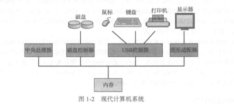

# 第一章：导论

操作系统是**管理计算机硬件**的程序。充当计算机用户和计算机硬件的中介。操作系统控制硬件，并协调各个用户应用程序的硬件使用。可以把操作系统类似于政府，其本身不能实现任何有用功能，而是提供一个方便其他程序有效执行的工作环境。

## 1.1	操作系统的功能

计算机系统可以粗分为四个组件：`硬件`、`操作系统`、`应用程序`和`用户`。

### 1.1.1	用户视角

对于PC，主要目的是用户使用方便，次要的是性能，不在乎的是资源利用。

对于大型机或小型机相连的终端，设计目标是优化资源利用率：确保所有的CPU时间、内存和IO都能得到有效使用，并确保没有用户使用超过限额以外的资源。

对于工作站，需要兼顾方便性和资源利用率。

### 1.1.2	系统视角

操作系统应该考虑如何为各个程序和用户分配资源，一边资源系统能有效公平地运行。

### 1.1.3	操作系统的定义

## 1.2	计算机系统的组成

### 1.2.1	计算机系统的运行

现代通用计算机系统包括一个或多个CPU和若干设备控制器，通过公用总线相连而成，该总线提供了共享内存的访问。每个设备控制器负责一类特定的设备。CPU与设备控制器可以并发执行，并且竞争访问内存。为了有序访问共享内存，需要内存控制器来协调访问内存。

#### 1.计算机，启动！

当计算机电源打开或者重启的时候，需要运行一个初始程序，也就是**引导程序**。这个初始程序一般位于计算机的固件（ROM或EEPROM）。引导程序初始化系统的各个组件。引导程序必须定位操作系统内核并加载到内存。一旦内核加到内存并执行，就开始为系统与用户提供服务。

除了内核外，系统程序也提供了一些服务，他们在启动时加到内存而成为**系统进程**或**系统后台程序**，生命周期和内核一样。这也就是为什么，在使用老电脑的时候，开机后需要等待一会才能打开应用程序。

#### 2.中断

事件发生通常通过硬件或软件的中断来通知。硬件可以发送信号到CPU来出发中断，软件也可以通过系统调用来出发中断。

CPU上会运行两种程序，一种是操作系统内核程序，一种是应用程序。当发生中断时，CPU从用户态切换为核心态。CPU上会运行两种程序，一种是操作系统内核程序，一种是应用程序。中断就是使CPU停止执行应用程序，转为执行操作系统内核程序。

中断又可以分为**内中断**和**外中断**

- 内中断也被成为**异常**，中断的信号来自CPU内部，根据具体情况分成**陷阱**、**故障**、**终止**
- 外中断是狭义上的中断，中断信号来自CPU外部，比如时钟信号和IO中断请求

中断是计算机能并发执行的关键。

### 1.2.2	存储结构

CPU只能从内存中加载指令，因此执行程序必须位于内存。
